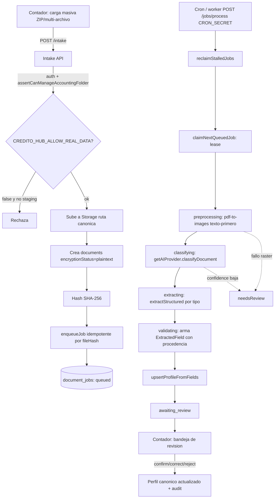
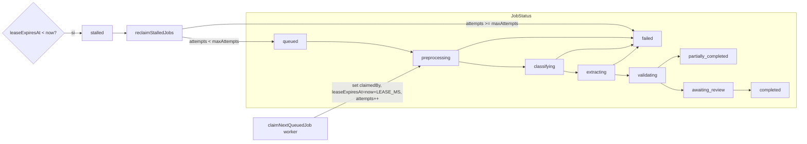

# CreditoHub — 004 · Arquitectura técnica

**Fecha:** 2026-06-16
**Estado:** Diseño (Ola 1 / Agente C). Sin código.
**Fuente de verdad de decisiones:** `docs/credito-hub/000-ola0-decisiones.md`.

---

## Objetivo

Definir la arquitectura del pipeline documental asíncrono de CreditoHub sobre el stack real (Next.js App Router + Firebase Admin SDK + TypeScript), reusando OCR/IA, grants y auditoría existentes, sin abrir accesos directos de cliente a Firestore/Storage.

## Alcance

- Capa IA multiproveedor (`lib/ai/`).
- Cola de jobs con lease (`document_jobs`) y worker.
- Rutas API server-side (intake, worker, jobs, review, requisitos).
- No incluye UI (ver Olas 4) ni el modelo de datos detallado (ver `005-modelo-datos.md`).

## Decisiones

1. **Todo server-side con Admin SDK.** Las rutas nuevas usan `verifyRequestSession` + `assertCanManageAccountingFolder(session, targetOrganizationId)` / grants. El cliente nunca lee/escribe Firestore o Storage de legajo directo (P1 Plan 013).
2. **`organizationId` nunca viene del body.** El cliente envía `targetOrganizationId`; el server deriva `folderOwnerOrganizationId` + `accountingFirmId` server-side.
3. **Capa IA detrás de una interfaz.** `getAIProvider()` resuelve por `AI_PROVIDER` (`xai` | `anthropic` | `mock`). El resto del código nunca llama un SDK concreto.
4. **PDF texto-primero.** `lib/ai/pdf-to-images.ts` extrae texto nativo (`pdfjs-dist`, sin canvas); rasteriza solo si hace falta (escaneado), limitado a `MAX_PDF_PAGES`. Ante fallo → `needsReview`, no rompe el job.
5. **Procesamiento asíncrono con lease.** El intake solo encola. Un worker (`/api/credito-hub/jobs/process`, protegido por `CRON_SECRET`) procesa hasta `MAX_JOBS_PER_RUN` por invocación, tomando jobs con `claimedBy`/`leaseExpiresAt` y recuperando `stalled`.
6. **Storage canónico, sin cambios.** Se reusa la ruta de `app/api/accounting/statements/extract/route.ts`:
   `orgs/{folderOwnerOrganizationId}/producers/{producerId}/periods/{periodId}/...`
   (el segmento `producers/{producerId}` es legacy de routing; el dato canónico es `folderOwnerOrganizationId`).

## Componentes

| Capa | Archivos (objetivo) | Responsabilidad |
|---|---|---|
| IA | `lib/ai/*` (`AIProvider`, `XaiProvider`, `AnthropicProvider`, `MockAIProvider`, `pdf-to-images`) | Clasificar, extraer, completar. Resolver modelo de visión a runtime. |
| Cola | `lib/services/document-jobs.ts`, `lib/credito-hub/limits.ts` | Encolar idempotente, transicionar, claim/lease, reclaim stalled. |
| Clasificación | `lib/ai/classification/*`, `lib/services/document-classification.ts` | Tipo documental + `needsReview`. |
| Extracción | `lib/ai/extraction/*`, `lib/services/extracted-fields.ts`, `lib/services/canonical-profile.ts` | Campos con procedencia + perfil canónico. |
| Requisitos | `lib/ai/bank-requirements/*`, `lib/services/{bank-requirements,credit-applications,requirement-matching}.ts` | Template + matching + `CreditApplication`. |
| API | `app/api/credito-hub/*` | Intake, worker, jobs, review, requisitos. Auth server-side. |

## Diagrama — Pipeline documental

## Diagrama — Cola con lease

## Límites (de Ola 0 §4 → `lib/credito-hub/limits.ts`)

`MAX_FILE_SIZE_PDF_IMG=10MB` · `MAX_FILE_SIZE_EXCEL=5MB` · `MAX_ZIP_SIZE=50MB` · `MAX_PDF_PAGES=8` · `MAX_JOBS_PER_RUN=5` · `MAX_ATTEMPTS=3` · `LEASE_MS=120000` · `JOB_TIMEOUT_MS=90000`.

## Alternativas
- **Cola externa (PubSub/QStash):** descartado para MVP; basta un worker idempotente disparado por cron sobre Firestore con lease.
- **Rasterizar siempre:** descartado por costo y riesgo de binarios en Vercel; texto-primero es más barato y exacto.

## Riesgos
- Worker caído deja jobs colgados. Mitigación: lease + `reclaimStalledJobs`.
- Timeout de Vercel en el worker. Mitigación: `MAX_JOBS_PER_RUN` + `JOB_TIMEOUT_MS`.
- `pdf-to-img`/`@napi-rs/canvas` en serverless. Mitigación: spike previo (Ola 0 §6) y fallback a `needsReview`.

## Criterios de aceptación
- 3 archivos → 3 jobs idempotentes; un worker los lleva a `awaiting_review` sin perder el lease.
- Ninguna ruta nueva abre lectura/escritura directa de cliente a Firestore/Storage de legajo.
- Cambiar `AI_PROVIDER` no requiere tocar servicios ni rutas.

## Dependencias
- `lib/firebase/admin-sdk.ts`, `lib/firebase/audit.ts`, `lib/auth/accounting-access.ts`.
- Patrón `app/api/cron/expire-grants/route.ts` para `CRON_SECRET`.

## Preguntas abiertas
- ¿El worker se dispara por Vercel Cron, llamada manual o ambos en MVP?
- ¿Confirmación final del id de modelo de visión xAI (pendiente de key)?
