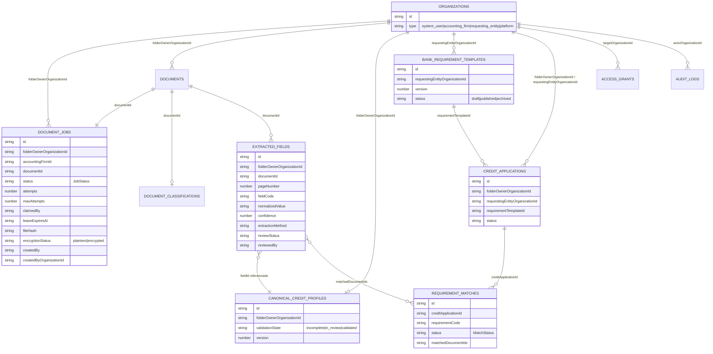

# CreditoHub — 005 · Modelo de datos

**Fecha:** 2026-06-16
**Estado:** Diseño (Ola 1 / Agente C). Sin código.
**Fuente de verdad de decisiones:** `docs/credito-hub/000-ola0-decisiones.md`.

> Las definiciones de tipos son responsabilidad del **Agente B** (`types/`, `lib/schemas/`, `collections.ts`, `types/audit.ts`). Este doc describe el modelo; la forma exacta de los tipos vive en código.

---

## Objetivo

Documentar las colecciones nuevas de CreditoHub, sus relaciones y la regla de **nombres canónicos**, garantizando partition por `folderOwnerOrganizationId` y procedencia obligatoria del dato.

## Alcance
- Colecciones nuevas y su relación con las existentes.
- Nombres canónicos. **Sin `producerId`/`clientId` en datos nuevos.**
- No incluye reglas de seguridad (ver `009-seguridad-y-privacidad.md`).

## Regla de nombres canónicos (OBLIGATORIA)

| Canónico | Significado | Legacy prohibido en datos nuevos |
|---|---|---|
| `folderOwnerOrganizationId` | Org dueña del legajo. **Partition key.** | `producerId`, `clientId` |
| `accountingFirmId` | Org del estudio contable. | `accountantId` |
| `requestingEntityOrganizationId` | Org del banco / entidad solicitante. | `bankId` |
| `targetOrganizationId` | Org destino en access/financing/grants. | — |
| `createdBy` / `createdByOrganizationId` | UID y org del actor. | — |

## Colecciones nuevas (→ `lib/firebase/collections.ts`)

| Constante | Colección | Partition key | Propósito |
|---|---|---|---|
| `DOCUMENT_JOBS` | `document_jobs` | `folderOwnerOrganizationId` | Cola de procesamiento con lease. |
| `DOCUMENT_CLASSIFICATIONS` | `document_classifications` | `folderOwnerOrganizationId` | Tipo documental detectado + `needsReview`. |
| `EXTRACTED_FIELDS` | `extracted_fields` | `folderOwnerOrganizationId` | Cada dato con **procedencia** y `reviewStatus`. |
| `CANONICAL_CREDIT_PROFILES` | `canonical_credit_profiles` | `folderOwnerOrganizationId` | Perfil que **referencia** fieldIds (no valores sueltos). |
| `BANK_REQUIREMENT_TEMPLATES` | `bank_requirement_templates` | `requestingEntityOrganizationId` | Requisitos del banco, versionados. |
| `CREDIT_APPLICATIONS` | `credit_applications` | `folderOwnerOrganizationId` + `requestingEntityOrganizationId` | Une cliente, banco, template y matches. |
| `REQUIREMENT_MATCHES` | `requirement_matches` | vía `creditApplicationId` | Resultado del matching por requisito. |

Colecciones existentes reusadas: `documents` (archivo fuente con `encryptionStatus`), `organizations`, `organization_members`, `producer_accountant_links`, `access_grants`, `audit_logs`.

## Procedencia obligatoria (`ExtractedField`)

Ningún dato se guarda sin su origen. Campos clave: `documentId`, `pageNumber`, `confidence`, `extractionMethod` (`NATIVE_TEXT` | `OCR` | `TABLE_EXTRACTION` | `VISION_MODEL` | `MANUAL`), `reviewStatus` (`PENDING` | `CONFIRMED` | `CORRECTED` | `REJECTED`), `reviewedBy`, `reviewedAt`, `correctionReason`. El `CanonicalCreditProfile` solo referencia `fieldId`s confirmados.

## Diagrama ER

## Decisiones
- Partition de todo dato de legajo por `folderOwnerOrganizationId`.
- El perfil canónico **referencia fieldIds**, no copia valores: preserva procedencia y permite versionado.
- `CreditApplication` es la entidad que une cliente + banco + template; sin ella el matching flota (Ola 0 §2).
- `encryptionStatus` + `encryptionMetadata?` reservados en `documents`/`document_jobs` desde el día uno (forward-compatible con Plan 012).

## Alternativas
- **Guardar valores extraídos directo en el perfil:** descartado, rompe procedencia.
- **Reusar `financial_statement_imports`:** descartado; ese modelo es para volcado directo a balance, no para el pipeline con revisión campo-a-campo.

## Riesgos
- Reintroducir `producerId`/`clientId` por copiar patrones legacy. Mitigación: criterio de aceptación "cero `producerId`/`clientId`".
- Índices Firestore faltantes para consultas por `folderOwnerOrganizationId` + `status`/`reviewStatus`. Mitigación: declarar índices al implementar servicios.

## Criterios de aceptación
- Las 7 colecciones existen en `collections.ts` sin borrar las previas.
- Ningún tipo nuevo usa `producerId`/`clientId`.
- Cada `ExtractedField` tiene procedencia completa.
- Schemas Zod validan cuit (11 dígitos), confidence (0..1) y enums cerrados.

## Dependencias
- `lib/auth/accounting-access.ts` (deriva `folderOwnerOrganizationId` + `accountingFirmId`).
- `types/statement-imports.ts` (nombre `accountingFirmId` ya existente).

## Preguntas abiertas
- ¿`canonical_credit_profiles` es doc único por owner o uno por aplicación/período? (recomendado: uno por owner, versionado).
- ¿Índices compuestos necesarios? Definir al implementar la cola y la revisión.
