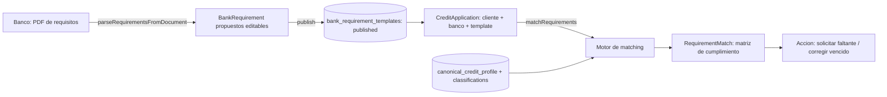

# CreditoHub — 008 · Requisitos bancarios

**Fecha:** 2026-06-16
**Estado:** Diseño (Ola 1 / Agente C). Sin código.
**Fuente de verdad de decisiones:** `docs/credito-hub/000-ola0-decisiones.md`.

---

## Objetivo

Permitir que un banco/entidad defina sus requisitos como template versionado, y cruzar (matching) ese template contra el legajo de un cliente para producir una matriz de cumplimiento. **La IA propone el parseo y el match; el resultado es informativo, no una aprobación de crédito.**

## Alcance
- Template de requisitos (`BankRequirementTemplate`) versionado y publicable.
- Parseo asistido por IA de un PDF de requisitos a `BankRequirement[]`.
- `CreditApplication` que une cliente + banco + template.
- Motor de matching → `RequirementMatch[]` con `MatchStatus`.
- MVP: un banco piloto.

## Entidades

### `BankRequirementTemplate`
- `organizationId = requestingEntityOrganizationId`, `version`, `status` (`draft` | `published` | `archived`), `requirements[]`.

### `BankRequirement`
- Código, categoría (ej. `FINANCIAL_STATEMENTS`, `TAX`, `LEGAL`), reglas de validación: `periodCount` (ej. "últimos 3 balances"), `maxAgeMonths`, `requiresCouncilCertification`, etc.

### `CreditApplication` (Ola 0 §2)
- `folderOwnerOrganizationId` (legajo) + `requestingEntityOrganizationId` (banco) + `requirementTemplateId`.
- `status`: `draft` | `submitted` | `in_review` | `awaiting_documents` | `approved` | `rejected` | `expired`.
- `RequirementMatch.creditApplicationId` referencia esta entidad. Audit `credit_application.created`.

### `RequirementMatch`
- `creditApplicationId`, `requirementCode`, `status: MatchStatus`, `matchedDocumentIds[]`, `explanation`, `responsibleRole`, `dueDate?`.
- `MatchStatus`: `fulfilled` | `partial` | `missing` | `expired` | `inconsistent` | `needs_review` | `not_applicable` | `pending_signature` | `pending_certification` | `substitutable`.

## Flujo

## Motor de matching

`matchRequirements(creditApplicationId)`: por cada requirement del template, busca documentos clasificados + datos del perfil canónico del `folderOwnerOrganizationId`, respeta `periodCount` y `maxAgeMonths`/vigencias, y produce un `MatchStatus` con `explanation` y `matchedDocumentIds`. Audit `requirement.matched`.

Ejemplos:
- "Últimos 3 balances certificados" → cuenta documentos clasificados como balance en los 3 períodos; `fulfilled` si están y vigentes, `partial`/`missing` si faltan, `pending_certification` si falta firma del Consejo.
- "Constancia de CUIT vigente" → `expired` si supera `maxAgeMonths`.

## Decisiones
- El parseo es **propuesta editable**; el banco confirma y publica. La IA no publica sola.
- Solo la org del banco o `admin_platform` crea/publica templates.
- El matching es informativo: no cambia el estado crediticio ni aprueba nada.
- Acceso a datos del legajo respeta grants/scopes existentes (ver `009-seguridad-y-privacidad.md`).

## Alternativas
- **Requisitos como texto libre sin estructura:** descartado; impide matching automático.
- **Matching sin `CreditApplication`:** descartado (Ola 0); el match quedaría sin entidad que lo contenga.

## Riesgos
- Parseo impreciso de PDFs de requisitos heterogéneos. Mitigación: propuesta editable + `needs_review`.
- Falsos `fulfilled` por documento mal clasificado. Mitigación: el match referencia documentos y el contador puede corregir la clasificación.
- Mostrar datos fuera del scope autorizado. Mitigación: grants/scopes en la API y UI.

## Criterios de aceptación
- PDF de requisitos → lista editable de `BankRequirement` → template publicado versionado.
- `matchRequirements` devuelve `fulfilled`/`missing`/`expired` correctos según períodos y vigencias (test).
- La matriz nunca expone datos fuera del scope del grant activo.

## Dependencias
- Ola 1 (tipos `bank-requirements` + `CreditApplication`, `lib/ai`).
- Ola 2 (perfil canónico, clasificaciones).
- Modelo de grants/scopes existente.

## Preguntas abiertas
- ¿Formato real del banco piloto? Define el primer template y el prompt de parseo.
- ¿`responsibleRole` se asigna automáticamente (contador vs. cliente) o lo decide el banco por requisito?
- ¿Se versiona la `CreditApplication` cuando el template cambia de versión?
